# IbDOpusScripts
Languages: [English](README.md), [简体中文](README.zh-Hans.md)

Some scripts for [Directory Opus](https://www.gpsoft.com.au/) ([中文介绍](https://github.com/Chaoses-Ib/DirectoryOpus)).

## Buttons
- [SmartExtract](Buttons/SmartExtract.js)

  Extract selected archive to subfolder if there's more than one file under the root path, otherwise (only one file) extract it directly.
  - Support multiple selection
  - Support selecting extracted file/directory after extraction

- [Everything 搜索](Buttons/EverythingSearch.zh-Hans.cmd.dcf)
  
  

  通过 [Everything](https://www.voidtools.com/) 在当前文件夹下搜索文件。

  在首次使用时需要先点击“设置 Everything 路径”进行初始化。默认热键 Ctrl+E。

- [控制面板-雨](Buttons/控制面板-雨.cmd.dcf)

  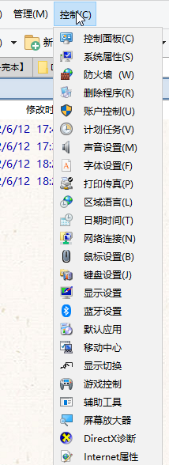

  作者：雨浪飘零

- [PasteInto](Buttons/PasteInto.dcf)

  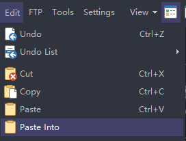

  Paste files into every selected folder.

- [系统管理-雨](Buttons/系统管理-雨.cmd.dcf)

  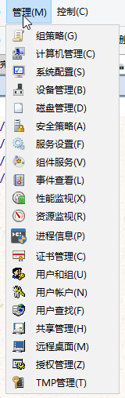

  作者：雨浪飘零

- ~~[CloseTabOrLister](Buttons/CloseTabOrLister.js)~~ (built-in since DOpus v12.2.6)
  
  If there's only one tab, close the lister, otherwise close current tab. (This script is for reference only. Starting with DOpus v12.2.6, this feature can be implemented by turning on "Lister closes when last tab closes" under `Preferences/Folder Tabs/Options`.)

## Commands
- [ClipEdit](Commands/ClipEdit.js)

  A forked version of [ClipEdit](https://resource.dopus.com/t/clipedit-modify-the-clipboard/44636?u=chaoses-ib) to fix some problems.

- [GetColumnValue](Commands/GetColumnValue.ouc)

  Get the value of the specified column to `glob:result`.

  For example:

  - Copy files' names and MD5 to clipboard
  
    ```cmd
    // The syntax is the same as the "New name" in the Advanced Rename dialog
    GetColumnValue "* {md5sum}"
    Clipboard SET {$glob:result}
    @set glob:result
    ```
    Corresponding result:
    ```
    .gitignore 3b121da4db64aa59864e9ed46fa68d0a
    LICENSE.txt dda85d3253cbd75fd74cceb14c1d8b02
    ```
  - Archive files with the name of the parent folder
  
    ```cmd
    GetColumnValue "{parent}"
    Copy ADDTOARCHIVE CREATEFOLDER="{$glob:result}" HERE
    @set glob:result
    ```
  
  `@set glob:result` is used to clear the result. It is optional but recommended.

- [Output](Commands/Output.ouc)

  Output text to script log.  
  
  e.g. `Output "sourcepath: {sourcepath}"`

- [ReplacePath](Commands/ReplacePath.ouc)

  Replace the current path.

  Switch between the same folders under C drive and D drive:
  ```cmd
  @ifpath:C:\*
  ReplacePath C:\ TO D:\
  @ifpath:D:\*
  ReplacePath D:\ TO C:\
  ```

  Switch between `Program Files` and `Program Files (x86)`:
  ```cmd
  @ifpath:*\Program Files(\*|)
  ReplacePath "\Program Files" TO "\Program Files (x86)"
  @ifpath:*\Program Files '(x86')(\*|)
  ReplacePath "\Program Files (x86)" TO "\Program Files"
  ```

- [Sleep](Commands/Sleep.ouc)

  Sleep for the specified milliseconds.
  
  e.g. `Sleep 3000`

- [Speak](Commands/Speak.ouc)

  Text to speech.

  e.g. `Speak "My Moon My Man"`

## Scripts
To use a script, you need to download it and put it into `/dopusdata\Script AddIns` (except for DialogJump).

- [DialogJump](Scripts/DialogJump.ahk)

  When in the editor of the file dialog, press Ctrl+G to jump to the last activated folder of listers. If Ctrl+G does not work, type "//cur " to trigger it. (Download the executable file from [Releases](https://github.com/Chaoses-Ib/IbDOpusScripts/releases) if you do not have [AutoHotkey v2](https://www.autohotkey.com/v2/))

- [EventWatchers](Scripts/EventWatchers)

  Output script event information when the event is triggered.

- [MaxViewerPane](Scripts/MaxViewerPane/MaxViewerPane.js)

  Maximize the viewer pane.

  Before | After
  --- | ---
  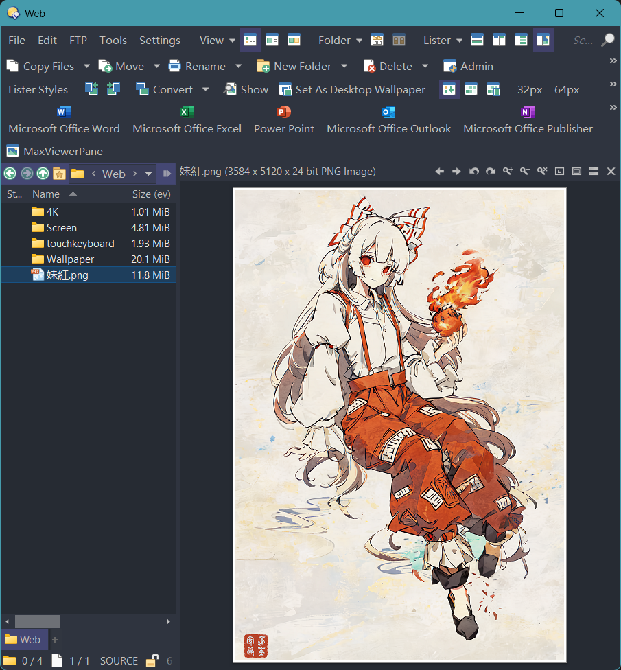 | 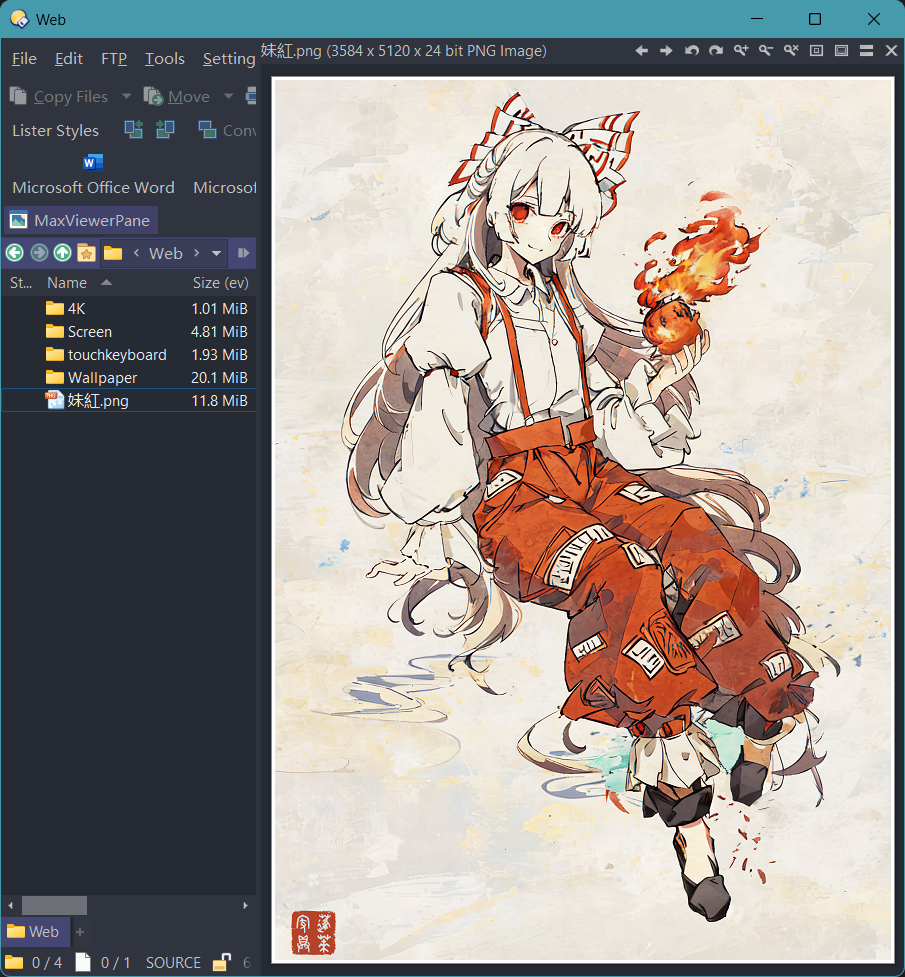

  This script requires a supporting executable `MaxViewerPane.exe`. You need to download the archive from [Releases](https://github.com/Chaoses-Ib/IbDOpusScripts/releases) and extract the folder next to the script (i.e. there should exist `/dopusdata\Script AddIns\MaxViewerPane\MaxViewerPane.exe`).

  Button: [MaxViewerPane.dcf](Scripts/MaxViewerPane/MaxViewerPane.cmd.dcf)

- [ObjectViewers](Scripts/ObjectViewers)

  Output script object information.

- [SmartThumbnailSize](Scripts/SmartThumbnailSize/SmartThumbnailSize.js)

  Automatically adjust the thumbnail ratio according to the images in the folder or the selected images.

  Before | After
  --- | ---
  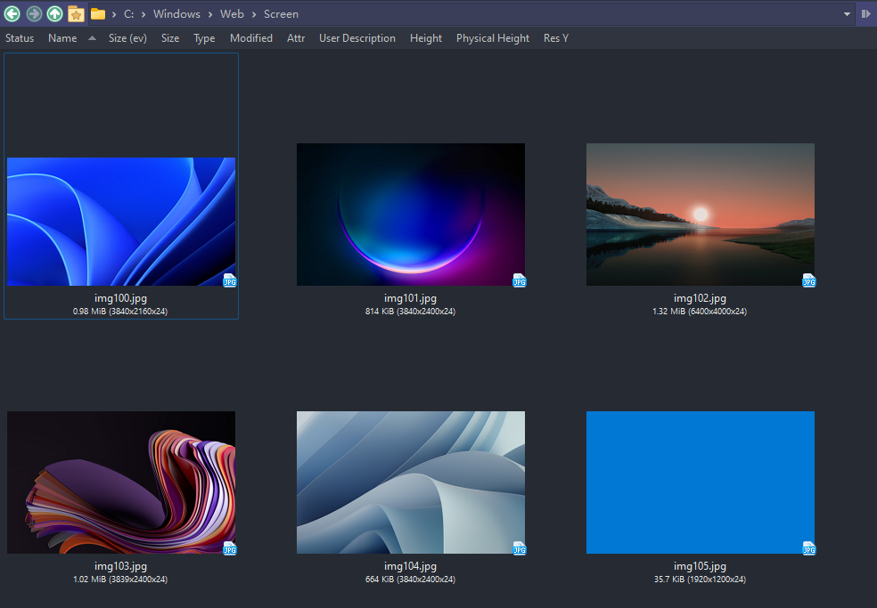 | 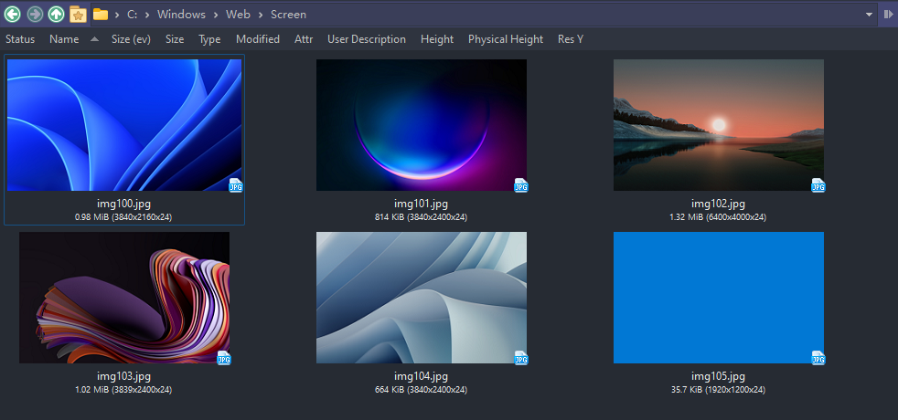

  You can set the thumbnail to specified size by running a command like `SmartThumbnailSize SIZE=256`.

  You can also import [the toolbar](Scripts/SmartThumbnailSize/SmartThumbnailSize.cmd.dop):

  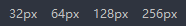

  Note that `SmartThumbnailSize` will only set the thumbnail size for the current file diaplay. This means that you can use it to set separate thumbnail sizes for each file display in a dual-display Lister:

  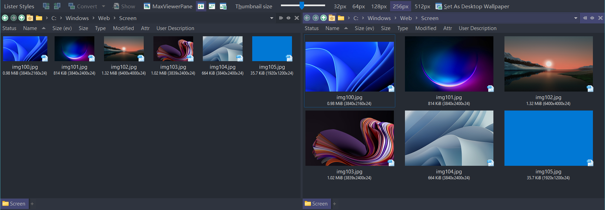

- [TabColorizer](Scripts/TabColorizer/TabColorizer.js)

  Colorize the folder tab with the color of its label.

  Before | After
  --- | ---
  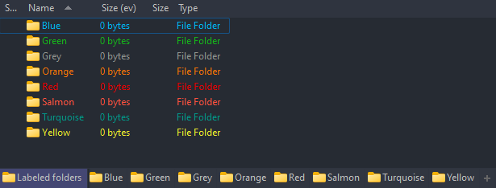 | 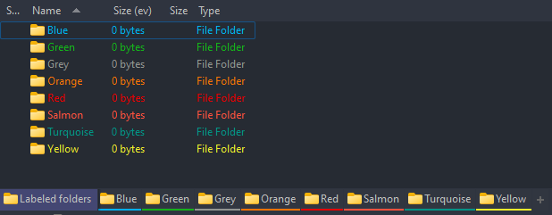

- ~~[SizeColByEverything](Scripts/SizeColByEverything/README.zh-Hans.md)~~ (built-in since DOpus v13)
  
  Add a size column which retrieves sizes of files and folders from Everything. (This script is for reference only. Use [IbDOpusExt](https://github.com/Chaoses-Ib/IbDOpusExt)'s Size column instead.)

Non-DOpus scripts:
- [OpenFileInWorkspace](Scripts/OpenFileInWorkspace)

  Given a file path, open its parent folder (or Git root) and show the file in VS Code.

  [Download](https://github.com/Chaoses-Ib/IbDOpusScripts/releases)

  To associate file types with this script, change their `open` action to `wscript "...\OpenFileInWorkspace.vbs" "%1"`, where `...\OpenFileInWorkspace.vbs` should be the absolute path to `OpenFileInWorkspace.vbs`.

  Can also be combined with [ObsidianShell](https://github.com/Chaoses-Ib/ObsidianShell) to try to open notes in Obsidian first and then fallback to VS Code workspace.

## Rename Scripts
- [PercentDecode](Rename%20Scripts/PercentDecode.js)

  Decode percent-encoding (URL encoding). For example, `%E4%BD%A0%E5%A5%BD` and `%u4F60%u597D` can be decoded to `你好`.

- [RandomString](Rename%20Scripts/RandomString.js)

  Replace `{randomString}` in the new name to random strings.

- [EncodingConvert](Rename%20Scripts/EncodingConvert.js)

  Mainly used to fix the character encoding of filenames. For example, you can fix the GBK-encoded `嬻偺嫬奅 椉媀幃` to Shift-JIS-encoded `空の境界 両儀式`.

  

  Support UTF-8, GBK, Big5, Shift-JIS and EUC-KR encodings.

- [繁体中文转简体](Rename%20Scripts/繁体中文转简体.js)

  例如将 `邊緣行者` 转换为 `边缘行者`。

- [简体中文转繁体](Rename%20Scripts/简体中文转繁体.js)

  例如将 `边缘行者` 转换为 `邊緣行者`。

- [中文数字转阿拉伯数字-WSQL](Rename%20Scripts/中文数字转阿拉伯数字-WSQL.vbs)

  例如将 `一百二十三` 转换为 `123`。支持大写数字。

- [阿拉伯数字转中文数字-WSQL](Rename%20Scripts/阿拉伯数字转中文数字-WSQL.vbs)

  例如将 `123` 转换为 `一百二十三`。支持大写数字。

- [阿拉伯数字转中文数字-无单位](Rename%20Scripts/阿拉伯数字转中文数字-无单位.js)

  例如将 `123` 转换为 `一二三`。支持大写数字。

- [中英混排加空格](Rename%20Scripts/中英混排加空格.js)

  在汉字和英文单词之间添加空格，例如将 `你好world` 转换为 `你好 world`。

## See Also
- [Telegram group](https://t.me/IbDirectoryOpusGroup)
- [IbDOpusExt](https://github.com/Chaoses-Ib/IbDOpusExt)
- [laoqiuqiu/DOpus-Script](https://github.com/laoqiuqiu/DOpus-Script)