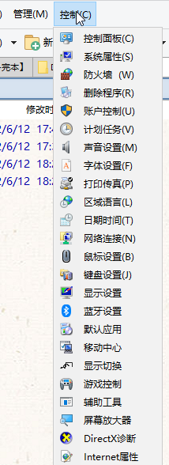
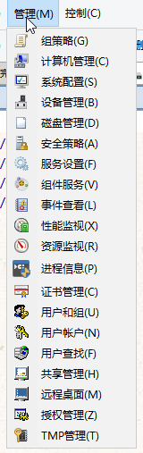
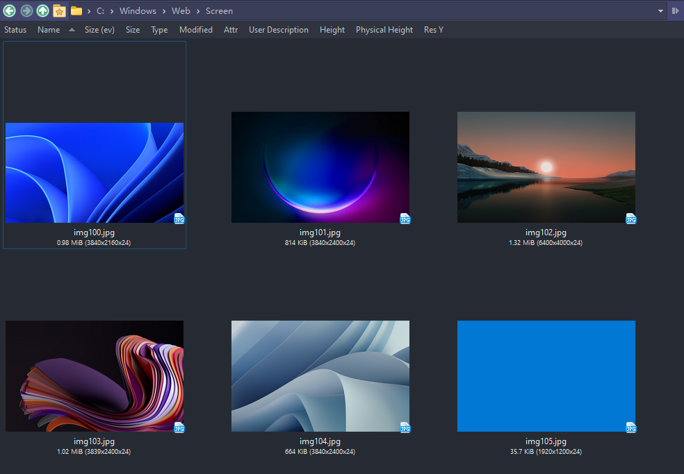
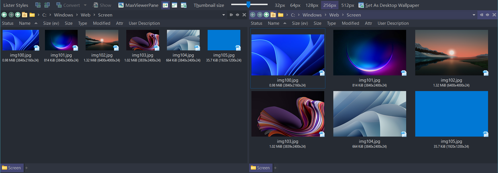
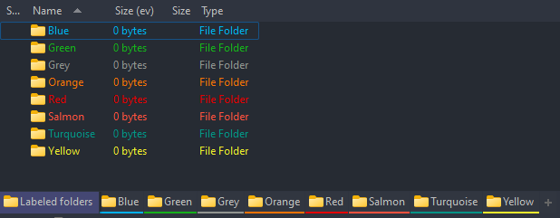

# IbDOpusScripts
语言：[English](README.md)，[简体中文](README.zh-Hans.md)

一些 [Directory Opus](https://github.com/Chaoses-Ib/DirectoryOpus) 的脚本。

## 按钮
- [SmartExtract](Buttons/SmartExtract.js)（智能解压）

  对于选中的压缩包，当压缩包根目录下只含有一个文件/目录时直接解压，否则解压到同名文件夹。
  - 支持多选
  - 支持选中解压出的文件/文件夹

- [Everything 搜索](Buttons/EverythingSearch.zh-Hans.cmd.dcf)
  
  

  通过 [Everything](https://www.voidtools.com/) 在当前文件夹下搜索文件。

  在首次使用时需要先点击“设置 Everything 路径”进行初始化。默认热键 Ctrl+E。

- [控制面板-雨](Buttons/控制面板-雨.cmd.dcf)

  

  作者：雨浪飘零

- [PasteInto](Buttons/PasteInto.zh-Hans.dcf)

  

  将文件粘贴进选中的每个文件夹中。

- [系统管理-雨](Buttons/系统管理-雨.cmd.dcf)

  

  作者：雨浪飘零

- ~~[CloseTabOrLister](Buttons/CloseTabOrLister.js)（关闭标签页）~~（DOpus v12.2.6 已内置）
  
  关闭当前标签页，如果只剩一个，就直接关闭窗口。（只作参考用途。从 DOpus v12.2.6 开始，可以通过勾选 `配置/文件夹标签/选项` 下的“关闭最后一个标签时同时关闭窗口”来实现该功能。）

## 命令
- [GetColumnValue](Commands/GetColumnValue.ouc)（获取列值）
  
  获取指定列的值到 `glob:result`。

  例子：
  - 复制文件的文件名和 MD5 到剪切板
  
    ```cmd
    // 语法与重命名对话框中的“新名称”相同
    GetColumnValue "* {md5sum}"
    Clipboard SET {$glob:result}
    @set glob:result
    ```
    对应结果：
    ```
    .gitignore 3b121da4db64aa59864e9ed46fa68d0a
    LICENSE.txt dda85d3253cbd75fd74cceb14c1d8b02
    ```

  - 压缩文件，使用父文件夹作为压缩包名称
  
    ```cmd
    GetColumnValue "{parent}"
    Copy ADDTOARCHIVE CREATEFOLDER="{$glob:result}" HERE
    @set glob:result
    ```
  
  `@set glob:result` 用于清除结果，可以省略，但是推荐使用。

- [Output](Commands/Output.ouc)（输出）

  输出文本到脚本日志。  

  例如：`Output "sourcepath: {sourcepath}"`

- [ReplacePath](Commands/ReplacePath.ouc)（替换路径）

  替换当前路径。

  在C盘和D盘下的相同文件夹间切换：
  ```cmd
  @ifpath:C:\*
  ReplacePath C:\ TO D:\
  @ifpath:D:\*
  ReplacePath D:\ TO C:\
  ```

  在 `Program Files` 和 `Program Files (x86)` 之间切换：
  ```cmd
  @ifpath:*\Program Files(\*|)
  ReplacePath "\Program Files" TO "\Program Files (x86)"
  @ifpath:*\Program Files '(x86')(\*|)
  ReplacePath "\Program Files (x86)" TO "\Program Files"
  ```

- [Sleep](Commands/Sleep.ouc)

  休眠指定的毫秒时间。
  
  例如：`Sleep 3000`

- [说](Commands/Speak.zh-Hans.ouc)（[Speak](Commands/Speak.ouc)）

  文本转语音。

  例如：`说 "荒耶 所求为何"`

## 脚本
要使用一个脚本，你需要将它下载到 `/dopusdata\Script AddIns`（除了 DialogJump）。

- [DialogJump](Scripts/DialogJump.ahk)（对话框跳转）

  在文件对话框编辑框中按 Ctrl+G 跳转到 DOpus 最近激活的文件夹。Ctrl+G 无效时可以输入“//cur ”来触发。（如果没有 [AutoHotkey v2](https://www.autohotkey.com/v2/) 的话可以从 [Releases](https://github.com/Chaoses-Ib/IbDOpusScripts/releases) 下载可执行文件）

- [EventWatchers](Scripts/EventWatchers)（查看脚本事件）

  触发脚本事件时输出事件信息。

- [MaxViewerPane](Scripts/MaxViewerPane/MaxViewerPane.js)

  最大化查看器窗格。

  使用前 | 使用后
  --- | ---
   | 

  该脚本需要一个配套的可执行文件 `MaxViewerPane.exe`。你需要从 [Releases](https://github.com/Chaoses-Ib/IbDOpusScripts/releases) 下载压缩包，并将文件夹解压到脚本旁（即应该存在 `/dopusdata\Script AddIns\MaxViewerPane\MaxViewerPane.exe`）。

  按钮：[MaxViewerPane.dcf](Scripts/MaxViewerPane/MaxViewerPane.cmd.dcf)

- [ObjectViewers](Scripts/ObjectViewers)（查看脚本对象）

  输出脚本对象信息。

- [SmartThumbnailSize](Scripts/SmartThumbnailSize/SmartThumbnailSize.js)

  根据文件夹中的图片或选中的图片自动调整缩略图比例。

  使用前 | 使用后
  --- | ---
   | 

  你可以通过运行类似 `SmartThumbnailSize SIZE=256` 的命令来将缩略图设置为指定尺寸。

  你也可以导入[工具栏](Scripts/SmartThumbnailSize/SmartThumbnailSize.cmd.dop)：

  

  注意，`SmartThumbnailSize` 仅会设置当前文件列表的缩略图尺寸。这意味着你可以用它来在一个双栏窗口中为每个文件列表分别设置不同的缩略图尺寸：

  

- [TabColorizer](Scripts/TabColorizer/TabColorizer.js)

  使用文件夹标记的颜色对文件夹标签进行染色。

  使用前 | 使用后
  --- | ---
   | 

- ~~[SizeColByEverything](Scripts/SizeColByEverything/README.zh-Hans.md)（Ev 尺寸列）~~（DOpus v13 已内置）
  
  为 DO 添加一个 Size 列，通过 Everything 获取文件和文件夹的大小。（只作参考用途，请使用 [IbDOpusExt](https://github.com/Chaoses-Ib/IbDOpusExt) 的尺寸列替代。）

非 DOpus 脚本:
- [OpenFileInWorkspace](Scripts/OpenFileInWorkspace)

  给定一个文件路径，在 VS Code 中打开它的父文件夹（或 Git 根目录）并显示该文件。

  [下载](https://github.com/Chaoses-Ib/IbDOpusScripts/releases)

  要将文件类型关联到这个脚本，需要将它们的 `open` 动作改为 `wscript "...\OpenFileInWorkspace.vbs" "%1"`，其中 `...\OpenFileInWorkspace.vbs` 应为 `OpenFileInWorkspace.vbs` 的绝对路径。

  也可以与 [ObsidianShell](https://github.com/Chaoses-Ib/ObsidianShell) 结合使用，在打开笔记时先尝试在 Obsidian 中打开，再回落到 VS Code 工作区。

## 重命名脚本
- [PercentDecode](Rename%20Scripts/PercentDecode.js)（百分号解码）

  解码百分号编码（URL编码），例如将 `%E4%BD%A0%E5%A5%BD` 和 `%u4F60%u597D` 解码为 `你好`。 

- [RandomString](Rename%20Scripts/RandomString.js)（随机文本）

  替换新名称中的 `{randomString}` 为随机文本。

- [EncodingConvert](Rename%20Scripts/EncodingConvert.js)（编码转换）

  主要用于修复文件名乱码，例如将 GBK 编码的 `嬻偺嫬奅 椉媀幃` 修复为 Shift-JIS 编码的 `空の境界 両儀式`。 

  

  支持 UTF-8、GBK、Big5、Shift-JIS 和 EUC-KR 编码。

- [繁体中文转简体](Rename%20Scripts/繁体中文转简体.js)

  例如将 `邊緣行者` 转换为 `边缘行者`。

- [简体中文转繁体](Rename%20Scripts/简体中文转繁体.js)

  例如将 `边缘行者` 转换为 `邊緣行者`。

- [中文数字转阿拉伯数字-WSQL](Rename%20Scripts/中文数字转阿拉伯数字-WSQL.vbs)

  例如将 `一百二十三` 转换为 `123`。支持大写数字。

- [阿拉伯数字转中文数字-WSQL](Rename%20Scripts/阿拉伯数字转中文数字-WSQL.vbs)

  例如将 `123` 转换为 `一百二十三`。支持大写数字。

- [阿拉伯数字转中文数字-无单位](Rename%20Scripts/阿拉伯数字转中文数字-无单位.js)

  例如将 `123` 转换为 `一二三`。支持大写数字。

- [中英混排加空格](Rename%20Scripts/中英混排加空格.js)

  在汉字和英文单词之间添加空格，例如将 `你好world` 转换为 `你好 world`。

## 相关推荐
- [Telegram 群组](https://t.me/IbDirectoryOpusGroup)
- [IbDOpusExt](https://github.com/Chaoses-Ib/IbDOpusExt)
- [laoqiuqiu/DOpus-Script](https://github.com/laoqiuqiu/DOpus-Script)