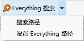

# IbDOpusScripts
语言：[English](README.md)，[简体中文](README.zh-Hans.md)  
一些 [Directory Opus](https://github.com/Chaoses-Ib/DirectoryOpus) 的脚本。

## 按钮
- [AutoExtract](Buttons/AutoExtract.js)（自动解压）  
  对于选中的压缩包，如果根目录内文件多于一个，就解压到子文件夹；如果只有一个，就直接解压到当前目录。
- [Everything 搜索](Buttons/EverythingSearch.zh-Hans.dcf)  
  通过 [Everything](https://www.voidtools.com/) 在当前文件夹下搜索文件。  
  

  在首次使用时需要先点击“设置 Everything 路径”进行初始化。默认热键 Ctrl+E。
- [PasteInto](Buttons/PasteInto.js)（粘贴进去）  
  把文件粘贴进每个选中的文件夹。
- ~~[CloseTabOrLister](Buttons/CloseTabOrLister.js)（关闭标签页）~~  
  关闭当前标签页，如果只剩一个，就直接关闭窗口。（只作参考用途，更好的实现方式是勾选 `配置/文件夹标签/选项` 下的“关闭最后一个标签时同时关闭窗口”。）

## 命令
- [Output](Commands/Output.ouc)（输出）  
  输出文本到脚本日志。  

  例如：`Output "sourcepath: {sourcepath}"`
- [ReplacePath](Commands/ReplacePath.ouc)（替换路径）  
  替换当前路径。

  在C盘和D盘下的相同文件夹间切换：
  ```cmd
  @ifpath:C:\*
  ReplacePath C:\ TO D:\
  @ifpath:D:\*
  ReplacePath D:\ TO C:\
  ```

  在 `Program Files` 和 `Program Files (x86)` 之间切换：
  ```cmd
  @ifpath:*\Program Files(\*|)
  ReplacePath "\Program Files" TO "\Program Files (x86)"
  @ifpath:*\Program Files '(x86')(\*|)
  ReplacePath "\Program Files (x86)" TO "\Program Files"
  ```
- [Sleep](Commands/Sleep.ouc)  
  休眠指定的毫秒时间。
  
  例如：`Sleep 3000`

## 脚本
- [DialogJump](Scripts/DialogJump.ahk)（对话框跳转）  
  在文件对话框编辑框中按 Ctrl+G 跳转到 DOpus 最近激活的文件夹。Ctrl+G 无效时可以输入“//cur ”来触发。（如果没有 [AutoHotkey v2](https://www.autohotkey.com/v2/) 的话可以从 [Releases](../../releases) 下载可执行文件）
- [EventWatchers](Scripts/EventWatchers)（查看脚本事件）  
  触发脚本事件时输出事件信息。
- [ObjectViewers](Scripts/ObjectViewers)（查看脚本对象）  
  输出脚本对象信息。
- ~~[SizeColByEverything](Scripts/SizeColByEverything/README.zh-Hans.md)（Ev 尺寸列）~~  
  为 DO 添加一个 Size 列，通过 Everything 获取文件和文件夹的大小。（只作参考用途，请使用 [IbDOpusExt](https://github.com/Chaoses-Ib/IbDOpusExt) 的尺寸列替代。）

## 重命名脚本
- [PercentDecode](Rename%20Scripts/PercentDecode.js)（百分号解码）  
  解码百分号编码（URL编码），例如将 `%E4%BD%A0%E5%A5%BD` 解码为 `你好`。 
- [EncodingConvert](Rename%20Scripts/EncodingConvert.js)（编码转换）  
  主要用于修复文件名乱码，例如将 GBK 编码的 `嬻偺嫬奅 椉媀幃` 修复为 Shift-JIS 编码的 `空の境界 両儀式`。 

    
  支持 UTF-8、GBK、Big5、Shift-JIS 和 EUC-KR 编码。
- [中文数字转阿拉伯数字-WSQL](Rename%20Scripts/中文数字转阿拉伯数字-WSQL.vbs)  
  例如将 `一百二十三` 转换为 `123`。支持大写数字。
- [阿拉伯数字转中文数字-WSQL](Rename%20Scripts/阿拉伯数字转中文数字-WSQL.vbs)  
  例如将 `123` 转换为 `一百二十三`。支持大写数字。
- [阿拉伯数字转中文数字-无单位](Rename%20Scripts/阿拉伯数字转中文数字-无单位.js)  
  例如将 `123` 转换为 `一二三`。支持大写数字。
- [中英混排加空格](Rename%20Scripts/中英混排加空格.js)  
  在汉字和英文单词之间添加空格，例如将 `你好world` 转换为 `你好 world`。

## 相关推荐
- [IbDOpusExt](https://github.com/Chaoses-Ib/IbDOpusExt)
- [laoqiuqiu/DOpus-Script](https://github.com/laoqiuqiu/DOpus-Script)