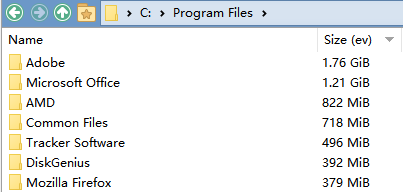

# SizeColByEvetyhing
作者：混沌Ib  
版本：210310  
Git：https://github.com/Chaoses-Ib/IbDOpusScripts  

只作参考用途，请使用 [IbDOpusExt](https://github.com/Chaoses-Ib/IbDOpusExt) 的尺寸列替代。

## 功能
为 DO 添加一个 Size 列，通过 Everything 获取文件和文件夹的大小。  

## 已知问题
* 性能较差，3000 个文件需要一分钟多才能显示完毕（受 DO 局限）
* 不支持符号链接和 Junction
	* 无法在链接目录内显示文件大小
	* 子文件夹是链接目录的话不会计入总大小（受 Ev 局限）
* 文件数量过多时可能会引发崩溃

建议只用作偶尔分析硬盘占用的工具。

## 安装步骤
1. 设置 Everything 索引文件夹大小：  
工具-选项-索引-索引文件夹大小
1. 安装 Everything IPC 组件  
把 IPC 目录里的 DLL 随便找个地方放着，脚本能调用到就可以
1. 安装 DynamicWrapperX  
把 DynamicWrapperX 目录里的 DLL 随便找个地方放着，然后用管理员权限在那里打开命令行，执行 regsvr32 dynwrapx64.dll（或者 regsvr32 dynwrapx32.dll）
1. 安装脚本  
DOpus：配置-工具栏-脚本-导入，把 SizeColByEverything.js 拖进去。  
点击编辑，把第10行的路径替换为你在第二步把 DLL 放置到的路径，注意反斜杠要写成 \\\\。